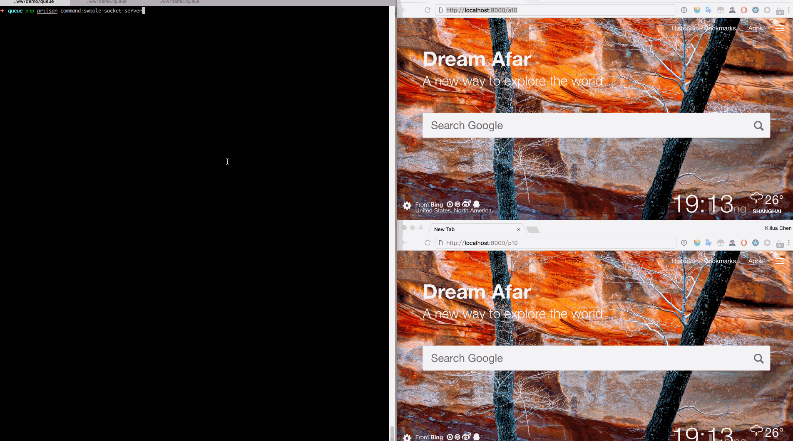

### Laravel中使用Swoole Webocket 服务端主动发送消息

### 场景
> 一个系统中有两个身份(agent和provider),一些案件状态的数据,在其它程序中发生改变需要实时通知用户,需要服务端主动发送消息
> 我们用a表示agent,p表示provider

### 安装依赖
- php >= 5.6.4
- redis-server
- php-redis
- php-swoole


### 配置启动
- .env中配置redis连接信息
    ```bash
    REDIS_HOST=127.0.0.1
    REDIS_PASSWORD=null
    REDIS_PORT=6379
    ``` 
- .env中配置swoole
    ```bash
    SWOOLE_HOST=127.0.0.1
    SWOOLE_PORT=9501
    ```

- 启动一个WebSocket服务
    ```bash
    php artisan command:swoole-socket-server
    ```
- 启动一个Reids队列监听器
    ```bash
    php artisan command:listen-queue
    ```
- 启动一个php server进行浏览器访问
    ```bash
    php artisan serve
    ```
### 使用
- 登录一个agent身份
> http://localhost:8000/a10
- 登录一个provider身份
> http://localhost:8000/p10
- 登录redis,在de_queue列表中存入数据让监听器处理
    ```bash
    $ redis-cli
    $ lpush de_queue '{"cmd":"case_status","datas":{"case_id":100,"status":6,"agent_id":"a10","provider_id":"p10"}}
    ``` 
### 压测
```bash
php artisan command:pressure-test
```
- 打开`http://localhost:8000/pressure/test`会随机写入测试数据
### 效果

